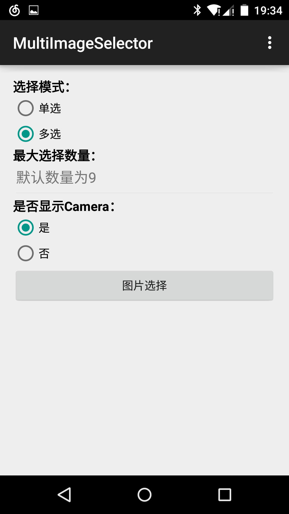
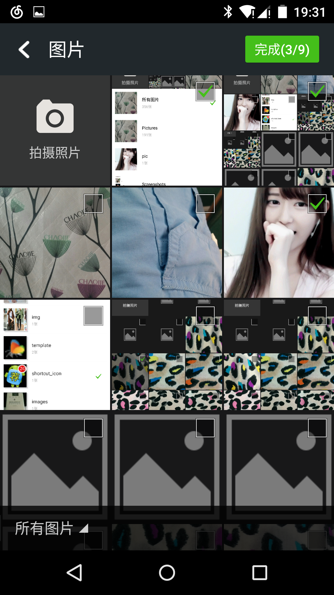
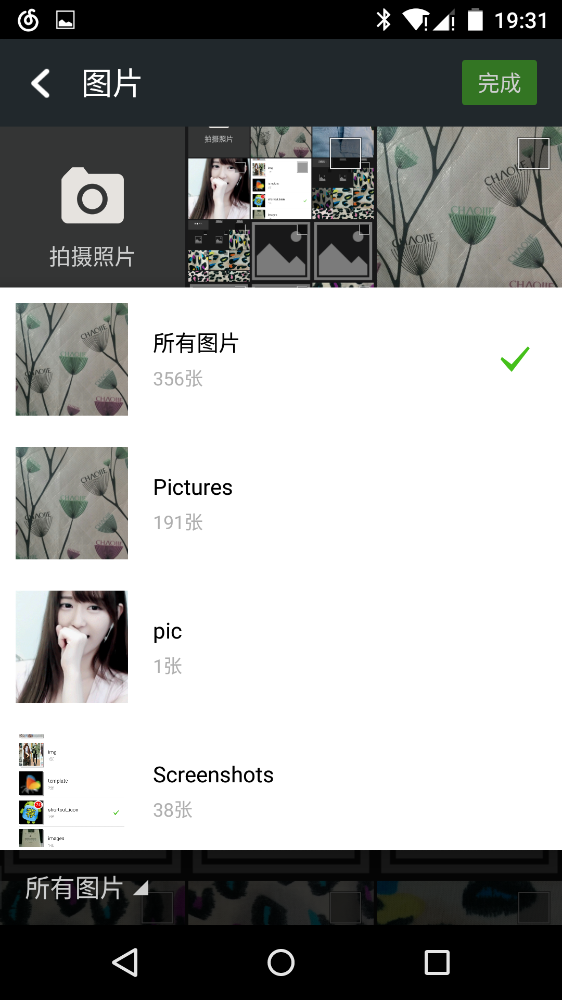

# MultiImageSelector
仿微信实现多图选择。支持单选和多选两种模式

[](https://jitpack.io/#lovetuzitong/MultiImageSelector)

[English Doc](README.md)

###截图
   

-------------------

###运行DEMO

>./gradlew installDebug

###快速开始
* 第0步
把模块 `multi-image-selector` 作为你的项目依赖添加到工程中. 在项目`build.gradle` 中:
```java
repositories {
    maven { url "https://jitpack.io" }
}

dependencies {
    compile 'com.github.lovetuzitong:MultiImageSelector:1.2'
}
```

* 第1步 
在你的 `AndroidManifest.xml` 中做如下声明:
```xml
<uses-permission android:name="android.permission.READ_EXTERNAL_STORAGE" />
<uses-permission android:name="android.permission.WRITE_EXTERNAL_STORAGE" />

<application

    ...

    <!--Image Selector Entry-->
    <activity
        android:configChanges="orientation|screenSize"
        android:name="me.nereo.multi_image_selector.MultiImageSelectorActivity" />
</application>
```

* 第2步
在你的代码中简单调用( 版本`version-1.1`之后支持 ), eg.

``` java
// Multi image selector form an Activity
MultiImageSelector.create(Context)
        .start(Activity, REQUEST_IMAGE);
```

详细可使用的Api.
``` java
MultiImageSelector.create(Context)
        .showCamera(boolean) // 是否显示相机. 默认为显示
        .count(int) // 最大选择图片数量, 默认为9. 只有在选择模式为多选时有效
        .single() // 单选模式
        .multi() // 多选模式, 默认模式;
        .origin(ArrayList<String>) // 默认已选择图片. 只有在选择模式为多选时有效
        .start(Activity/Fragment, REQUEST_IMAGE);
```

同样支持老版本的 `Intent` 调用方法:
```java
Intent intent = new Intent(mContext, MultiImageSelectorActivity.class);
// 是否显示调用相机拍照
intent.putExtra(MultiImageSelectorActivity.EXTRA_SHOW_CAMERA, true);
// 最大图片选择数量
intent.putExtra(MultiImageSelectorActivity.EXTRA_SELECT_COUNT, 9);
// 设置模式 (支持 单选/MultiImageSelectorActivity.MODE_SINGLE 或者 多选/MultiImageSelectorActivity.MODE_MULTI)
intent.putExtra(MultiImageSelectorActivity.EXTRA_SELECT_MODE, MultiImageSelectorActivity.MODE_MULTI);
// 默认选择图片,回填选项(支持String ArrayList)
intent.putStringArrayListExtra(MultiImageSelectorActivity.EXTRA_DEFAULT_SELECTED_LIST, defaultDataArray);
startActivityForResult(intent, REQUEST_IMAGE);
```

* 第3步
在你的 `onActivityResult` 方法中接受结果. 例如:
```java
@Override
protected void onActivityResult(int requestCode, int resultCode, Intent data) {
    super.onActivityResult(requestCode, resultCode, data);
    if(requestCode == REQUEST_IMAGE){
        if(resultCode == RESULT_OK){
            // 获取返回的图片列表
            List<String> path = data.getStringArrayListExtra(MultiImageSelectorActivity.EXTRA_RESULT);
            // 处理你自己的逻辑 ....
        }
    }
}
```

* 第4步
没第4步了，就这样就OK啦~ :)

-------------------

###自定义显示
* 自定义Activity
```java
class CustomerActivity extends Activity implements MultiImageSelectorFragment.Callback{
	@Override
    protected void onCreate(Bundle savedInstanceState) {
		// 你自己的逻辑...
        Bundle bundle = new Bundle();
        bundle.putInt(MultiImageSelectorFragment.EXTRA_SELECT_COUNT, mDefaultCount);
        bundle.putInt(MultiImageSelectorFragment.EXTRA_SELECT_MODE, mode);
        <bundle class="putBo"></bundle>olean(MultiImageSelectorFragment.EXTRA_SHOW_CAMERA, isShow);
        // 添加主Fragment到Activity
        getSupportFragmentManager().beginTransaction()
                .add(R.id.image_grid, Fragment.instantiate(this, MultiImageSelectorFragment.class.getName(), bundle))
                .commit();
	}
	@Override
    public void onSingleImageSelected(String path) {
        // 当选择模式设定为 单选/MODE_SINGLE, 这个方法就会接受到Fragment返回的数据
    }

    @Override
    public void onImageSelected(String path) {
        // 一个图片被选择是触发，这里可以自定义的自己的Actionbar行为
    }

    @Override
    public void onImageUnselected(String path) {
        // 一个图片被反选是触发，这里可以自定义的自己的Actionbar行为
    }

    @Override
    public void onCameraShot(File imageFile) {
        // 当设置了使用摄像头，用户拍照后会返回照片文件
    }
}
```
* 具体可以参考`MultiImageSelectorActivity.java`的实现

-------------------

###更新日志

* 2016-5-18
    1. 新增. `JitPack` 支持
    2. 新增. 简单的调用方式. 详细参见 `第2步`
    3. Fixed. 修复某些情况下碰到的空指针异常.

* 2016-1-19
    1. 修复. 无法加载大小为0的图片
    2. 新增. 拍照后通知媒体扫描,加入图库
    3. 修复. 红米无法拍照问题
    4. 优化. 拍照Item的显示

* 2015-5-5
    1. 修复. 某些图片无法显示. (Issue by[sd6352051](https://github.com/sd6352051), [larry](https://github.com/18611480882))
    2. 修复. `ListPopupWindow` 无法填充父控件
    3. 新增. 选中的遮罩效果.

* 2015-4-16
    1. 修复. 旋转设备时，程序会崩溃. (Issue by [@Leminity](https://github.com/Leminity))
    2. 修复. 文件夹PopupListView位置错误. (Issue by [@Slock](https://github.com/Slock))
    3. 更改. 演示程序截图.
    4. 更改. Readme 文件.

* 2015-4-9
    1. 修复. 当设置 `EXTRA_SHOW_CAMERA` 为 `true` 时, 点击第一个Item会混乱的问题.
    2. 新增. 支持初始化图片选择设定。


-------------------

###感谢

* [square-picasso](https://github.com/square/picasso) A powerful image downloading and caching library for Android 

-------------------

###License
>The MIT License (MIT)

>Copyright (c) 2015 Nereo

>Permission is hereby granted, free of charge, to any person obtaining a copy
of this software and associated documentation files (the "Software"), to deal
in the Software without restriction, including without limitation the rights
to use, copy, modify, merge, publish, distribute, sublicense, and/or sell
copies of the Software, and to permit persons to whom the Software is
furnished to do so, subject to the following conditions:

>The above copyright notice and this permission notice shall be included in all
copies or substantial portions of the Software.